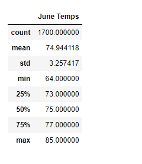
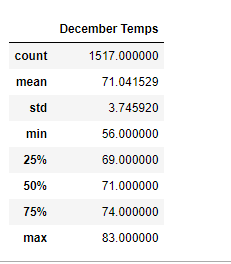
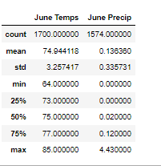
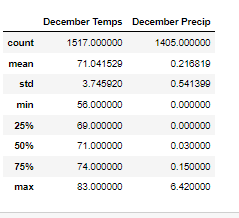

# **Surf's Up with Advanced Data Storage and Retrieval**
	
## **Overview of the analysis** 

* While on vacation on Hawaii last year, you discovered a newfound passion for surfing. You have been trying to come up with a plan that will help you not just to return to Hawaii but also live there. You come up with an idea of opening a Surf n' Shake shop, that serves surfboards and ice cream to locals and tourists. W. Avy who is famous for his love of surfing, is an investor who will help with opening the shop. He wants to know more about whether there because of similar business that failed due to weather conditions. W. Avy would like you to perform analysis on weather dataset from Oahu, the Island where you would like to open your shop.

* W. Avy wants more information about temperature trends before opening the surf shop. Specifically, he wants temperature data for the months of June and December in Oahu, in order to determine if the surf and ice cream shop business is sustainable year-round. We will help with the analysis of the dataset.
  
### Purpose 
* to determine the Summary Statistics for temprature for June and December for Oahu. Also, to create a summary report for the statistical analysis.

## **Results** 

* June temprature for all the dataset 

 

* December temprature for all the dataset 

 

* list that addresses the three key differences in weather between June and December
	* the average temperature for June is 74.9 and for December is 71, there is 3 degrees difference 	
	* from the images above the max temperature for June is 85 and for December is 83, there is 2 degrees difference 
	* The minimum temperature for June is 64 while for December is 56, 8 degrees difference 	 

## **Summary** 

* from the images above we can see that the average, max and mean for June and December are very cose. This tells us that temprature in Oahu is same through out the year.

* two additional queries to perform to gather more weather data for June and December

* June temprature with precipitation 

 
* December temprature	with precipitation 

 
* added the precipitation and station to the queries for both June and December. we can see from the images above that the average precipitation for June is 14% while for December is 22%

* added the station to the query that helps us to select the station that has the best temperature and low chances of rain 

* further we can query other months to check the temperature and precipitations. As well we can also include wind in the query since that can affect surfing 

* Based on the temperature and precipitation analysis, Oahu Hawaii is the best location to open the Surf n' Shake shop since the temperature is very nice throughout the year and there is low chance of rain.

